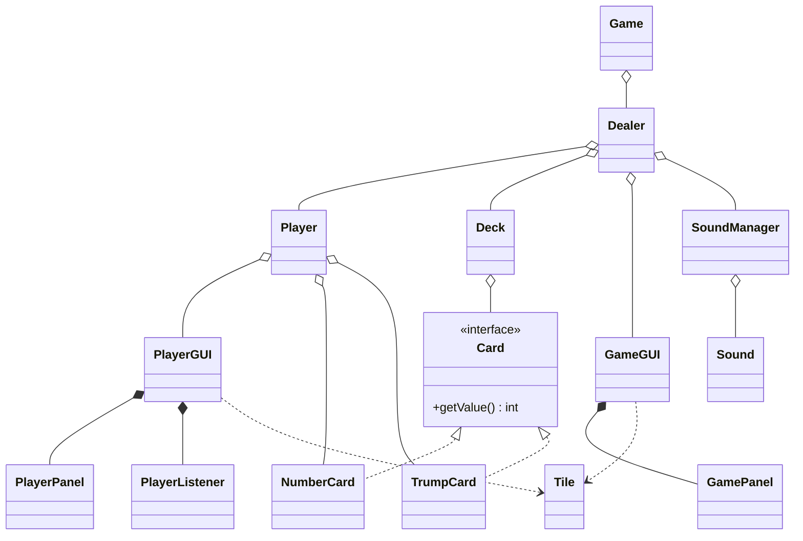

# Twenty One

Twenty One is a two-player, blackjack-inspired Java game. Players draw numbered cards and try to finish as close as possible to a target score without exceeding it. Trump cards can change the target, draw a specific card, or modify the round's bet. A foam-dart blaster provides a school-safe elimination mechanic after each round.

The project uses Java Swing for its interfaces and separates game logic, player state, cards, rendering, input, and audio into dedicated classes.

## Gameplay

1. Both players enter their names.
2. Each player receives two number cards: one face up and one face down. Each player also receives two trump cards.
3. Turn order is selected at the start of the round.
4. On a turn, a player may:
   - **Hit** to draw a random number card.
   - **Stand** without drawing a card.
   - **Play a trump card** to alter the round.
5. A player who exceeds the current target busts. If both players bust, the hand closer to the target wins.
6. The round also ends if the deck runs out or both players stand consecutively without playing trump cards.
7. The losing player faces the foam-dart punishment once for each point in the current bet. A dart hit eliminates that player and ends the game; otherwise, the chamber is spun again and a new round begins.

The default target is 21. The bet begins at one, increases after each round, and may also be changed by trump cards.

## Trump Cards

| Type | Variants | Effect |
| --- | --- | --- |
| Draw | Draw 1 through Draw 11 | Takes the named number card if it remains in the deck. |
| Go For | 17, 24, or 27 | Replaces 21 with a new target score. |
| Bet | One Up, Two Up, and Shield | Raises the bet by one or two, or reduces it with Shield. |

## Architecture

### Core Classes

| Class | Responsibility |
| --- | --- |
| `Game` | Initializes the application, collects player names, creates the interfaces, and starts the game loop. |
| `Dealer` | Runs each round, processes player actions, manages the target and bet, determines the winner, and controls the punishment sequence. |
| `Player` | Stores player state, number cards, trump cards, icon selection, and access to the player's interface. |
| `Deck` | Maintains the original and active card collections, shuffles cards, draws from the active deck, and retrieves a card by value. |
| `Card` | Defines the shared `getValue()` behavior for all cards. |
| `NumberCard` | Represents a numbered card from 1 through 11 and whether it is hidden. |
| `TrumpCard` | Represents a Draw, Go For, or Bet power-up and whether it has been played. |
| `SoundManager` | Organizes music and sound effects and controls their playback. |
| `Sound` | Loads and controls an individual Java audio clip. |

### Interface Classes

| Class | Responsibility |
| --- | --- |
| `GameGUI` | Displays the title screen, central play area, visible hands, target, bet, punishment sequence, and game-over screen. |
| `PlayerGUI` | Displays a player's private hand and trump-card descriptions. |
| `GamePanel` | Draws the changing central game states. |
| `PlayerPanel` | Draws a player's number and trump cards. |
| `PlayerListener` | Captures mouse input from the player window. |
| `Tile` | Loads and exposes an image for the game panels to draw. |

## Data Structures

| Component | Structure | Rationale |
| --- | --- | --- |
| Original deck | `ArrayList<Card>` | Supports constant-time indexed access for shuffling and retains the reusable card set. |
| Active deck | `LinkedList<Card>` | Supports constant-time removal from the front while cards are dealt. |
| Player hands | `ArrayList<Card>` | Supports fast indexed access and amortized constant-time appends for small card collections. |
| Trump descriptions | `HashMap<String, String[]>` | Provides average constant-time lookup of a trump card's title and description. |

## Running the Project

The application entry point is `Game.main(String[] args)`. Open the Java project in an IDE, ensure its image and sound assets are available at the expected paths, and run the `Game` class. The interfaces require a desktop environment with Java Swing and audio support.

## Authors

- Rohan Chaudhary
- Brian Lee
- Michael Lee

